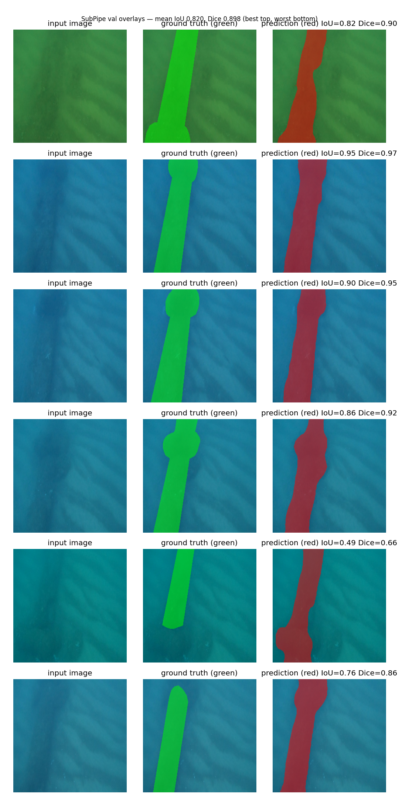

# SubSight: live inspection toolkit for small underwater scanners
Pipe segmentation runs now on public AUV survey data. Hull defect, sonar, enhancement and edge export follow in phases.

# Finding a subsea pipeline with a neural net

I'm a first-year mechanical engineering student and I want to work in subsea
engineering. For my portfolio I taught a U-Net to find a pipeline in murky
underwater photos, using real AUV survey data. It gets IoU 0.75 on held-out
frames. This repo is the whole thing: code, trained setup, results, and the
failure cases I don't want to hide.

Raw image in, binary pipe mask out, overlays to prove it.

## What it does

1. Reads image + mask pairs from the SubPipe `Segmentation/` folder (Chunk0).
2. Trains a U-Net (ResNet-34 encoder, pretrained on ImageNet) to output one
   mask per image: pipe or background.
3. Scores it with IoU and Dice on a held-out split, seed fixed, best weights
   kept in `best.pth`.
4. Saves overlay pictures sorted best to worst, so the misses are on display
   next to the wins.

## Dataset

Docs: https://github.com/remaro-network/SubPipe-dataset

Download: https://zenodo.org/doi/10.5281/zenodo.10053564 (I used
`SubPipeMini.zip`, about 6 GB — the full dump is ~80 GB and I didn't need it)

Paper: Alvarez-Tunon et al., *SubPipe: A Submarine Pipeline Inspection
Dataset for Segmentation and Visual-inertial Localization* (arXiv:2401.17907)

The data is CC-BY-4.0 per its Zenodo record and stays out of git. If you reuse it, include this:
SubPipe is a public dataset of a submarine outfall pipeline, property of
Oceanscan-MST. This dataset was acquired with a Light Autonomous Underwater
Vehicle by Oceanscan-MST, within the scope of Challenge Camp 1 of the H2020
REMARO project.

I only use Chunk0's `Segmentation/` folder: timestamped photos with matching
`<timestamp>_label.png` masks, one foreground class (`pipeline`, clamp
included). The masks nearly tricked me twice. They hold exactly {0, 1, 128}:
background (88%), pipe body (10.5%), pipe edge (1.5%, trained as pipe). And
106 of the 647 masks are RGB with the annotation hiding in the red channel,
which crashed my loader until I read them per-channel. `decode_mask()` in
`src/dataset.py` handles all of it and throws on anything it doesn't
recognise, because silent misreads are how you train on garbage for a week.

## How I built it

Resize everything to 256x256 (a free Colab T4 can't swallow more) and
normalise for the pretrained encoder. Training copies get flipped, slightly
rotated and shifted (an AUV never flies straight), plus brightness and colour
jitter for the water. Geometry applies to image and mask together or the mask
drifts off the pipe. Colour touches the image only.

The model is a plain U-Net from `segmentation-models-pytorch`, ResNet-34
backbone, one output channel per pixel, BCE loss. I kept one `build_model()`
function so swapping in SegFormer (what the paper used) is a config change
later, not a rewrite.

Training: Adam, lr 3e-4, 20 epochs, batch 8, 80/20 random split on seed 42.
One thing I'd flag to anyone reading closely: the paper splits chronologically
(60/20/20) because neighbouring video frames look alike, and they're right.
My random split probably flatters the score a bit. Chronological is on the
to-do list.

I score IoU (overlap over union, the paper's headline number, picks the
checkpoint) and Dice alongside it. I skipped pixel accuracy on purpose: 90% of
every frame is background, so predicting "no pipe anywhere" scores 90% and
finds nothing.

## Running it (free Colab T4)

```python
!pip install -r requirements.txt
```

```bash
# 1. Look at the masks first — I learned this the hard way
python notebooks/inspect_masks.py --root data/Chunk0/Segmentation --n 5
# -> prints UNIQUE VALUES + pipe fraction, saves outputs/inspect_examples.png

# 2. Train (minutes on a T4 at 256px)
python -m src.train --config configs/config.yaml
# -> checkpoints/best.pth (best val IoU) + checkpoints/last.pth

# 3. Score it + pictures
python -m src.evaluate --checkpoint checkpoints/best.pth --num-images 6
# -> prints mean IoU/Dice, saves outputs/eval_examples.png

# 4. Prediction video (val frames back in timestamp order, raw next to overlay)
python -m src.make_video --checkpoint checkpoints/best.pth --max-frames 100
# -> outputs/pred_video.mp4 (green = human label, red = model, IoU stamped)

# 5. Phase 1 honest splits (Colab T4, 256px, seed 42, no test leakage)
# chrono retrain: set `split: chrono` in configs/config.yaml, then rerun step 2
# cross-chunk score (same Chunk0 weights, no retrain):
python -m src.evaluate --checkpoint checkpoints/best.pth --data-root data/Chunk1/Segmentation --full-chunk
# repeat for Chunk2, Chunk3, Chunk4 and fill the Phase 1 gate table
```

## Results

| Split (seed 42) | IoU | Dice | Notes |
|---|---|---|---|
| Val (Chunk0, 80/20 random, seed 42) | 0.7459 | 0.8368 | U-Net resnet34, 256px, 20 epochs (best epoch 12, 517 train / 130 val) |
| Paper reference (SegFormer/DeepLabV3, SubPipeMini) | — | — | The paper says IoU has "room for improvement". Don't compare numbers directly, different split and data. |

0.75 on murky water with a tiny baseline. I'll take it. One caveat stays: random split on sequential video frames flatters the score via temporal correlation. Neighbours look alike, so val shares scenes with train. Phase 1 gate below fixes that read.

Phase 1 gate (same weights logic, honest splits, no test leakage):

| Test | IoU | Dice | Notes |
|---|---|---|---|
| Chunk0 random 80/20 | 0.7459 | 0.8368 | Baseline above, locked in tag v1-subpipe-baseline |
| Chunk0 chrono 60/20/20 val | TBC | TBC | Set `split: chrono` in config, retrain on Colab T4, test stays locked |
| Chunk0 chrono held-out test | TBC | TBC | Score once, never train on it |
| Chunk1 full chunk | TBC | TBC | Same Chunk0 weights, `--full-chunk`, no retrain |
| Chunk2 full chunk | TBC | TBC | Same as above |
| Chunk3 full chunk | TBC | TBC | Same as above |
| Chunk4 full chunk | TBC | TBC | Same as above |

Gate passes when the table is full and the drop from random to chrono to cross-chunk is reported as is. SegFormer comparison runs at 256px on the chrono split before any 512px run. No 512px until the 256px baseline is defended.

All tasks (one repo, one toolkit):

| Task | Data | Status | Score |
|---|---|---|---|
| pipe-seg | SubPipe Chunk0 | Baseline done, Phase 1 hardening in progress | Val IoU 0.7459 / Dice 0.8368 (random, optimistic) |
| hull-defect | LIACI (TBC licence) | Spec only, see SPEC.md | — |
| sonar | SubPipe SSS or UATD (TBC licence) | Spec only, see SPEC.md | — |
| enhance | UIEB + EUVP (TBC licence) | Spec only, see SPEC.md | — |
| edge + demo | Jetson Orin Nano + UCL tow tank | Spec only, see SPEC.md | Latency vs accuracy curve TBC |

Overlays (`outputs/eval_examples.png`, best row first, worst last):



Green is the human label, red is my model. If the picture 404s, run step 3 above, that's where it gets made.

## Where it fails

Sand buries the pipe. This is a real outfall survey, not a test tank, and
whole stretches vanish under sand that even the annotators only found via
contrast-enhanced images. My worst val frame scores IoU 0.0000, a total miss
on a buried stretch. That's physics, not a bug, and it's staying in the
report.

Blur, growth, and the GoPro's auto-exposure swing colours frame to frame, and
256px eats thin edges. The colour jitter helps but can't rebuild an invisible
pipe.

Chunk0 with a random split is the other asterisk. Neighbouring frames
correlate, so 0.75 is optimistic against fresh surveys. Chronological split,
then Chunk1-4, is the honest next test.

Single class, RGB only. Clamp counts as pipe, there are no defect labels, and
I never touched the sonar. It finds pipe. It doesn't assess condition. Yet.

## Why bother

Someone still watches hours of AUV footage by eye: slow, pricey, and two
people disagree in bad visibility. A pipe mask per frame is the boring
foundation that automates the rest. Know where the pipe is in every frame and
you can track kilometres of it, pick out buried or spanning sections, measure
drift, and send humans only the hard frames. This is that first step, built
on real survey data, misses included.

## How I worked

Openly: I didn't type every line alone. I directed an AI coding assistant
stage by stage (skeleton, dataset, model, training, eval, writeup) and it
drafted the code. I ran every cell myself on Colab, read every output, and
made the calls. The mask saga was the real work: the {0,1,128} encoding, the
palette PNGs reading as grey 38, the red-channel RGB masks. The agent
suggested, I diagnosed, we fixed, I verified. The numbers above come from my
runs and I can walk through any file line by line. That was the point of
building in stages.

## Repo layout

```text
SubSight/ (renamed from SubPipe, old URL redirects, tag v1-subpipe-baseline locks the baseline)
├── configs/config.yaml      # every hyperparameter lives here, now with split: random/chrono
├── data/README.md           # where Chunk0 comes from (data itself not in git)
├── notebooks/inspect_masks.py  # look at the masks before trusting them
├── src/
│   ├── dataset.py           # pairs, random + chrono splits, full-chunk loader, mask decoding
│   ├── model.py             # U-Net, plus the SegFormer door left open
│   ├── train.py             # loss, IoU/Dice, val loop, checkpointing
│   ├── evaluate.py          # scores + best-to-worst overlays, plus --data-root/--full-chunk
│   ├── make_video.py        # val frames as raw-next-to-overlay video
│   └── utils.py             # seeds
├── SPEC.md                  # phases 2 to 5: data links, budget, tank demo plan
├── checkpoints/             # best.pth / last.pth (gitignored, too big anyway)
├── outputs/                 # pictures + video (gitignored, except eval_examples.png)
└── requirements.txt         # Colab-safe deps
```

Move to `tasks/pipe-seg/` happens after the Phase 1 gate table is full. History moves with `git mv`, logic stays put. No new task folders until then.

## Next

- [x] Stages 1-5: skeleton, dataset, U-Net, training, pictures
- [x] Stage 6: this writeup with real numbers
- [x] Mask encoding saga: {0,1,128} plus red-channel RGB variants, all handled
- [x] Baseline locked: tag v1-subpipe-baseline pushed, repo renamed SubPipe to SubSight
- [x] Chrono + cross-chunk code: `split: chrono` in config, `--data-root`/`--full-chunk` in eval
- [ ] Phase 1 gate: fill chrono + Chunk1-4 rows on Colab T4, report the drop
- [ ] SegFormer swap at 256px on chrono (`pip install transformers`, `architecture: segformer`)
- [ ] 512px inputs once the baseline is defended
