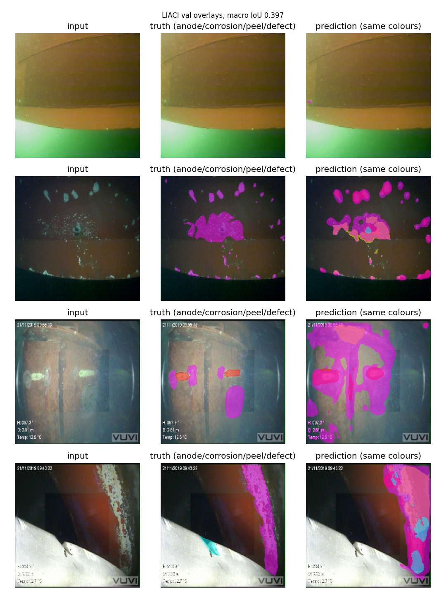

# Hull-defect head (Phase 2)

Multi-label segmentation on ship-hull stills: one channel per class,
sigmoid, BCE with rare-class weights. Growth sits on hull, so pixels
keep both tags.

## Data

LIACI semantic segmentation set, SINTEF: 1,893 frames at 1920x1080,
10 classes with one bitmap each plus merged masks, COCO labels and an
official train/test split (1,370 train / 523 val, seed 42 for shuffle
only). Licence CC BY-NC-SA 4.0: portfolio and research use fine,
credit SINTEF, commercial use forbidden. If you reuse it, cite Waszak
et al., IEEE Journal of Oceanic Engineering 2022.

Prevalence (non-empty frames): hull 88%, growth 46%, peel 45%, anode
28%, propeller 26%, grating 22%, valves 12%, corrosion 11%, keel 10%,
defect 4%. Anodes cover 1.9% of pixels when present.

## Model

U-Net ResNet-34, ImageNet start, 10 output channels, 256px, batch 8,
40 epochs, lr 3e-4. Loss 0.5 BCE with pos_weight plus 0.5 soft Dice.
pos_weight per class from measured pixel prevalence, capped at 50.
Checkpoint on macro IoU over classes present in val. Same backbone
family as pipe-seg for a fair read. Focal gamma 2 alpha 0.25 was
tested and dropped: macro 0.2037 with hull collapse.

## Results

| Class | IoU | Dice |
|---|---|---|
| ship_hull | 0.8303 | 0.9073 |
| anode | 0.1472 | 0.2566 |
| marine_growth | 0.3347 | 0.5016 |
| paint_peel | 0.1300 | 0.2301 |
| corrosion | 0.0837 | 0.1545 |
| defect | 0.0001 | 0.0002 |
| propeller | 0.6706 | 0.8028 |
| sea_chest_grating | 0.7462 | 0.8546 |
| over_board_valves | 0.6865 | 0.8141 |
| bilge_keel | 0.3399 | 0.5074 |
| macro (present) | 0.3969 | — |

BCE-Dice 40 epochs, best epoch 38, seed 42. BCE 20 epoch
baseline was 0.2491. Longer schedule plus Dice lifts hull,
propeller, grating, valves, keel. Defect at 4% prevalence
still reads 0.0. That class stays a stated gap.

Overlays (`outputs/eval.png`, anode/corrosion/peel/defect in colour):

## Next

- MobileNetV2 encoder per the paper's real-time pick
- Per-class video with all focus classes stamped
